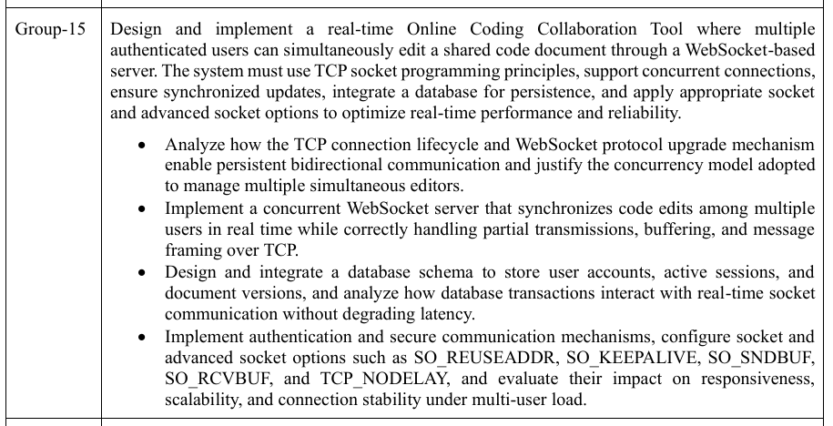
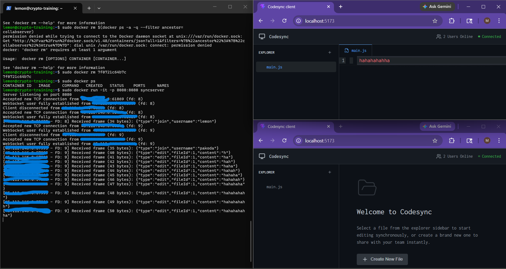
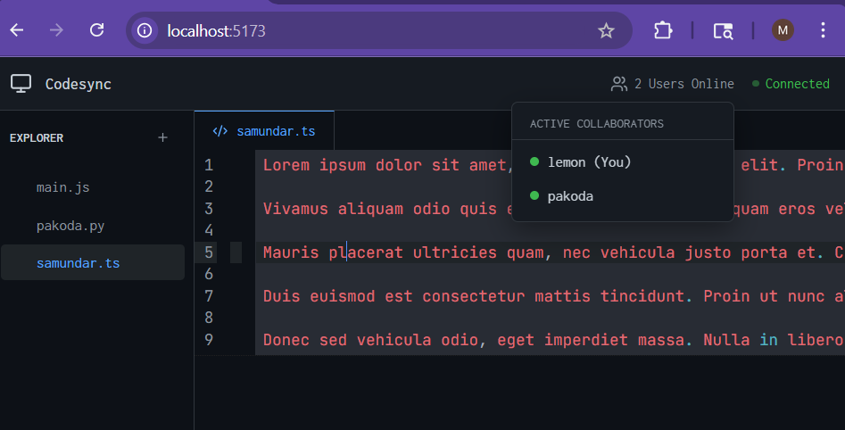
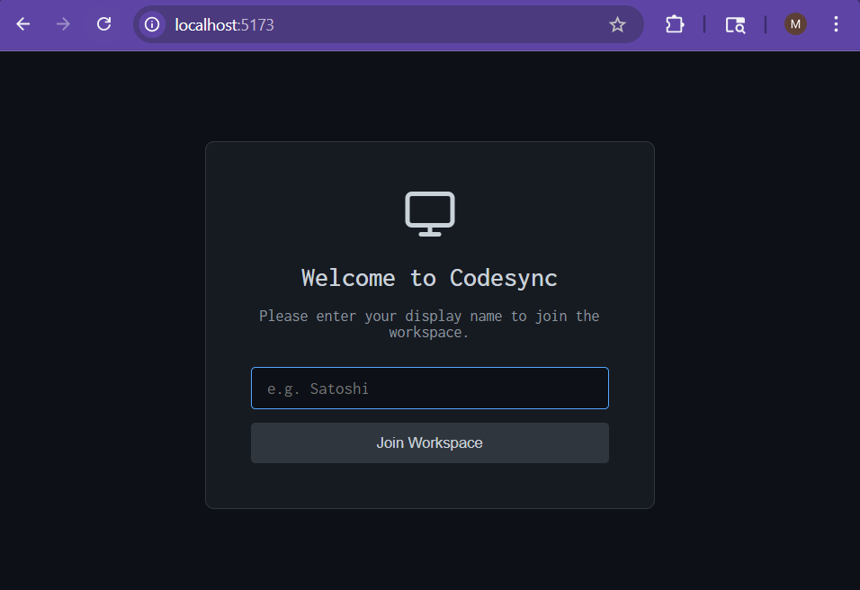

# codesync
NPACN (Network Programming and Communication Networks) project. 

## `PROBLEM STATEMENT`


## how to run this thing
### **`server`**
copy the folder [server](./server/) onto your machine \
download cJSON dependency from [here](https://github.com/DaveGamble/cJSON/blob/master/cJSON.c) or just :
```
wget https://github.com/DaveGamble/cJSON/blob/master/cJSON.c
wget https://github.com/DaveGamble/cJSON/blob/master/cJSON.h
```
Then build and run the docker image accordingly : 
```
docker build -t syncserver .
docker run -it -p 8080:8080 syncserver
```
> [!NOTE]
> if you dont want server logging, run detached docker image with `-d` instead of `-it`

server should be up with a 
`Server listening on port 8080`

***

### **`client`**
clone this repo, this is the client driver. \
Before anything in [`App.tsx`](./src/App.tsx), replace websocket url with your server ip \
```diff
- const socket = new WebSocket('ws://<SERVERIP>:8080');
+ const socket = new WebSocket('ws://67.67.67.67:8080');
```
then run `npm i` and `npm run dev` \
proceed to access at http://localhost:5173

***
## `SCREENSHOTS`




***
*Answers to textual questions from the problem statement annotated as commented code in server scripts, will elaborate separately here later.*
